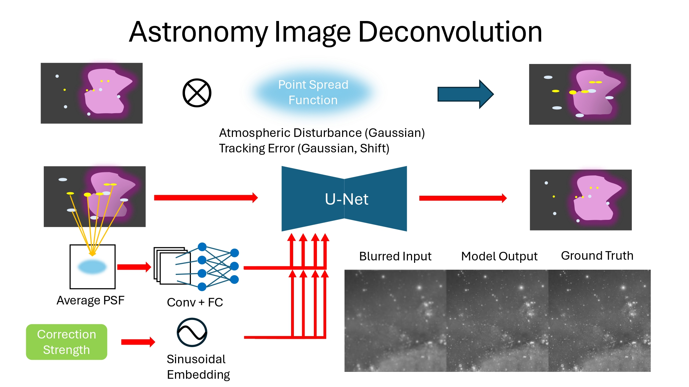

# fadatsai2

AI-based astronomy image deconvolution and sharpening tool.

This project uses a UNet–based neural network to restore blurred astrophotography images caused by atmospheric turbulence and tracking errors, leveraging point spread function (PSF) information and controllable correction strength.

## Overview

  

The model takes:
- Blurred astronomical images  
- Estimated PSF (Point Spread Function) from star points
- A tunable correction strength embedding  

and outputs a sharpened reconstruction approximating the ground truth.

## Status

🚧 Research / experimental project  
The software itself is **not open-source**. This repository contains documentation only.
